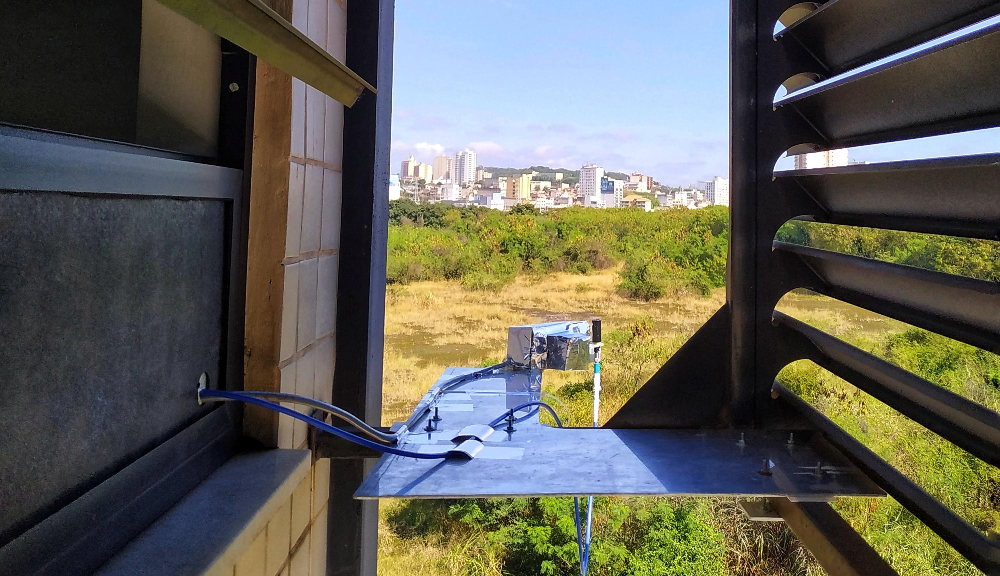

Olá! 😉

Meu nome é Amanda Rodrigues de Souza e este texto conta sobre a minha relação com a programação.

Minha trajetória na programação começou em 2013, na faculdade. Cursei Física com ênfase em Física Computacional pela Universidade Federal Fluminense, em Volta Redonda.

Durante a faculdade pude aprender sobre estrutura de dados, POO, Computação de alto desempenho e processamento de sinais. Só em disciplinas eu tive contato com várias linguagens, como C, C++, Java e Fortran90, além de conhecimentos transversais (Linux e LaTeX), extensão e pesquisa.

Tive a oportunidade de contribuir para um projeto incrível chamado [ADACA](https://adaca.com.br/) - Ambiente Digital para Aprendizagem de Crianças Autistas. Trabalhava da parte de jogos (javascript e css). Ajudei a expandir a biblioteca de jogos que são disponibilizados para as crianças atendidas. 

[Ambiente digital de aprendizagem para autistas – ADACA](https://uffacessivel.uff.br/?p=5378)

Durante a faculdade também fui bolsista PIBITI (Programa Institucional de Bolsas de Iniciação em Desenvolvimento Tecnológico e Inovação). Meu projeto, que virou minha monografia, foi sobre a construção de uma miniestação para monitoramento de poluentes atmosféricos. No projeto, eu construí uma estação usando Arduino (programação em C), os dados foram processados pelo DOASIS (JScript) e analisados usando Python (detalhe, aprendi python para fazer o projeto, tive uns seis meses para isso 🤐). 

Olha só que bonitinha ela ⬇️ 💟

Depois de terminar a faculdade, em 2019, resolvi fazer mestrado. Escolhi fazer mestrado em Ciência e Tecnologia Ambiental pela UFABC. Passei no primeiro edital do [MAI](https://mai-dai.ufabc.edu.br/) - Mestrado Acadêmico de Inovação, um projeto piloto do CNPq, no qual visa a parceria entre Universidades e o Setor Privado.

Minha pesquisa tinha como parceria a Empresa SOMAR Meteorologia, que foi absorvida pela ClimaTempo. Pesquisei sobre o uso de índices de precipitação para o previsão da vazão (conhecimento útil na hora de precificar nossa energia elétrica 💸)

E trabalhando no mestrado que me dei conta que o que eu fazia poderia ser chamado de análise ou ciência de dados. Fiz a análise de um grande volume de dados (centenas de estações, com dezenas de anos de dados diários), retirei os dados errados, fiz agrupamentos, analises de padrões, construí índices e ainda arrisquei um modelo preditivo. 

Tanto a pesquisa da minha dissertação, como outros estudos resultaram em algumas produções acadêmicas listadas a seguir. Vários dos scripts que construí para tais publicações não estamos disponíveis devido ao acordo de parceria.

No final do mestrado, me inscrevi e passei no programa Desenvolve 2023 do Grupo Boticário para a trilha de dados. Comecei a alimentar o github com as notas de aulas dos cursos que realizei e alguns scritps que fiz durante o mestrado.

Pretendo seguir adicionando aqui no github meus aprendizados, que continuarão focados na área de dados e assuntos correlacionados.

## Produções

Deixo aqui uma lista de produções científicas que escrevi e/ou contribuí com a criação de scripts de análise de dados:

### Simpósio em Clima, Água, Energia e Alimentos - 2021

[PADRÃO DE VAZÃO E EXTREMOS NA PARTE BAIXA DA BACIA DO RIO PARANÁ](https://proceedings.science/simclea-2021/trabalhos/padrao-de-vazao-e-extremos-na-parte-baixa-da-bacia-do-rio-parana?lang=pt-br)

### Congresso Brasileiro Interdisciplinar em Ciência e Tecnologia 2021

[Análise De Padrões E Extremos De Vazão Na Parte Alta Da Bacia Do Rio Paraná](https://www.even3.com.br/anais/cobicet/394389-analise-de-padroes-e-extremos-de-vazao-na-parte-alta-da-bacia-do-rio-parana/)

[Padrão De Vazão Da Bacia Do Rio Paraíba Do Sul: Estação Paraibuna](https://www.even3.com.br/anais/cobicet/394176-padrao-de-vazao-da-bacia-do-rio-paraiba-do-sul--estacao-paraibuna/)

[Padrões E Extremos De Vazões Na Bacia Do Rio São Francisco](https://www.even3.com.br/anais/cobicet/394142-padroes-e-extremos-de-vazoes-na-bacia-do-rio-sao-francisco/)

### Congresso Brasileiro Interdisciplinar em Ciência e Tecnologia 2022

[Caracterização E Correlação Da Vazão De Tucuruí Com Índices De Precipitação](https://www.even3.com.br/anais/cobicet2022/508629-caracterizacao-e-correlacao-da-vazao-de-tucurui-com-indices-de-precipitacao/)

[Eventos Extremos De Precipitação E Relação Chuva-Vazão Na Bacia Do Rio São Francisco](https://www.even3.com.br/anais/cobicet2022/508500-eventos-extremos-de-precipitacao-e-relacao-chuva-vazao-na-bacia-do-rio-sao-francisco/)

[Padrão E Extremos De Precipitação Na Cidade De São Paulo](https://www.even3.com.br/anais/cobicet2022/509785-padrao-e-extremos-de-precipitacao-na-cidade-de-sao-paulo/)

### Brazilian Journal of Development

[Identificação de índices de precipitação para previsão mensal de vazão no posto de Tucuruí – bacia do Tocantins](https://ojs.brazilianjournals.com.br/ojs/index.php/BRJD/article/view/55273)

### Engineering and Science

[Padrão e extremos de precipitação na cidade de São Paulo](https://periodicoscientificos.ufmt.br/ojs/index.php/eng/article/view/15137)

---

Você também pode ver um pouco mais sobre essa trajetória no meu Currículo Lattes:

[CV Lattes](http://lattes.cnpq.br/5465631741781705)

Se você chegou até aqui, mereço pelo menos uma conexão 😉:

[LinkedIn](https://www.linkedin.com/in/amanda-rs/)
